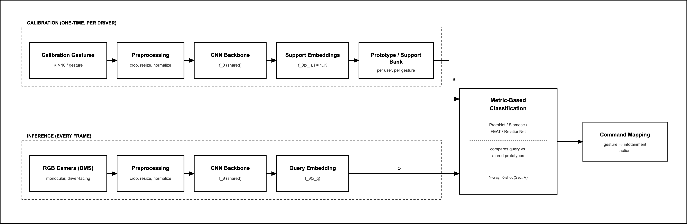
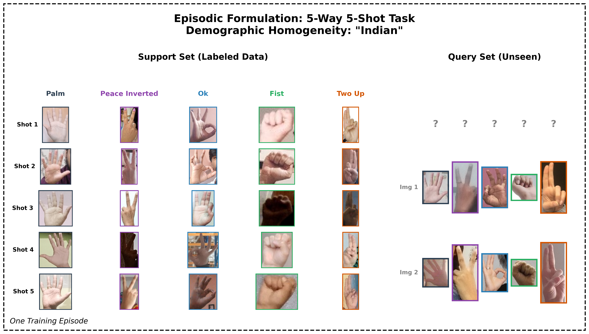
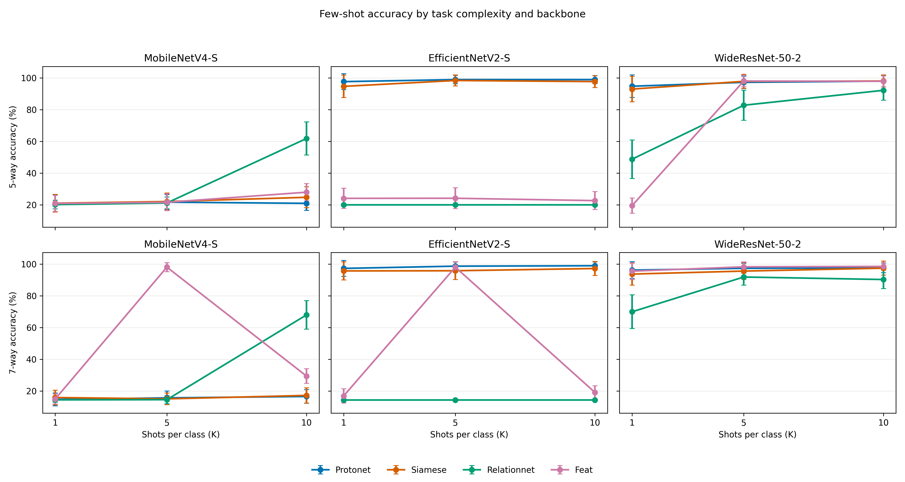
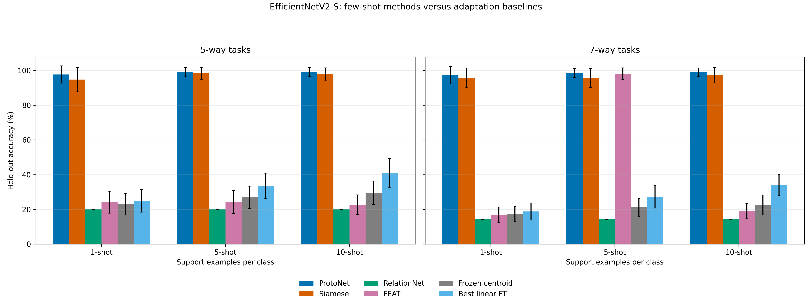
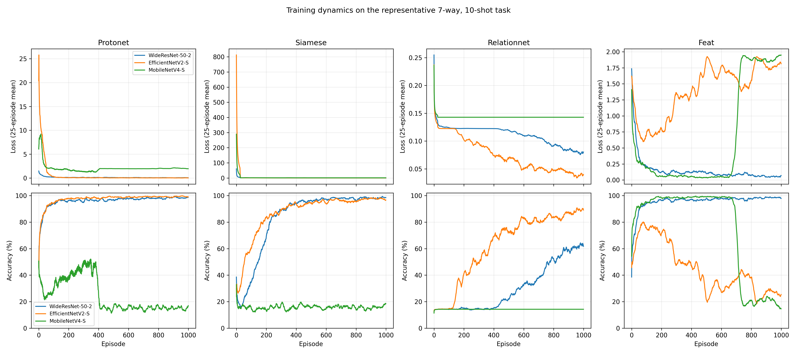
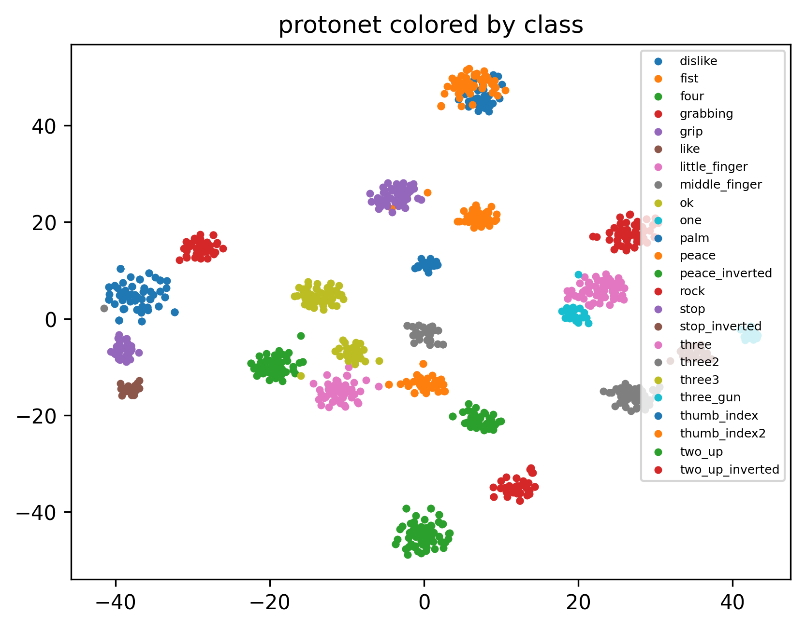
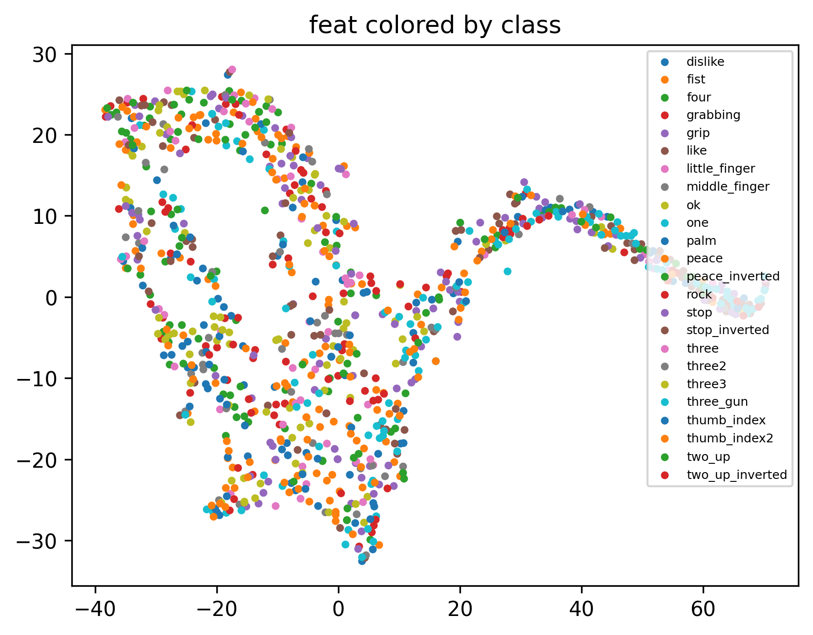
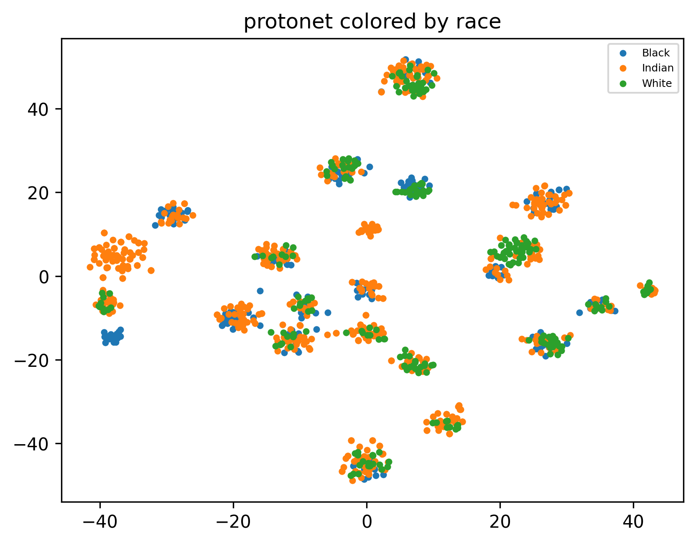
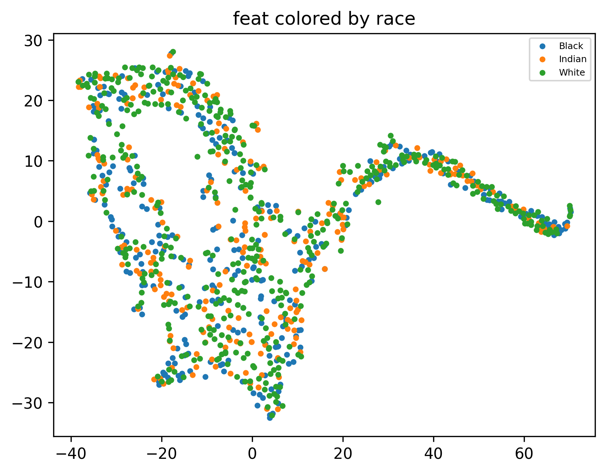
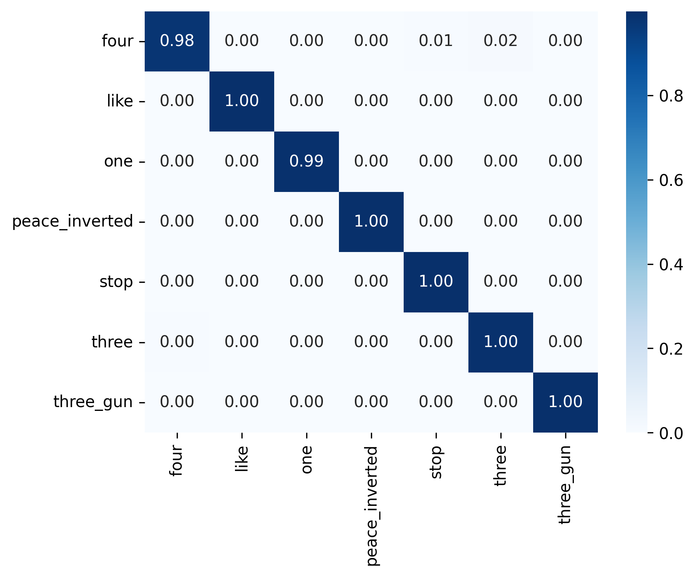

# Personalized Few-Shot Hand Gesture Recognition for Vehicle Infotainment

> A reproducible episodic metric-learning pipeline for personalizing static RGB hand-gesture commands with only a few calibration examples.

This repository accompanies the research project **“Personalized Few-Shot Hand Gesture Recognition for Vehicle Infotainment Systems.”** It evaluates Siamese Networks, Prototypical Networks (ProtoNet), Relation Networks, and FEAT across MobileNetV4-S, EfficientNetV2-S, and WideResNet-50-2 backbones.

The central deployment idea is simple: a trained model stays frozen, while a new driver supplies a small support set of comfortable gesture examples. The system embeds those examples, creates class representations, and classifies subsequent gesture images without retraining the full network.



## Highlights

- **Selected model:** ProtoNet + EfficientNetV2-S, 5-way, 10-shot.
- **Held-out episodic accuracy:** **98.99% +/- 2.63%** over 200 test episodes.
- **Paper-reported episodic query latency:** **2.27 ms/query** on the dual-T4 experiment environment.
- **Cross-demographic evaluation:** 99.08-99.33% held-out accuracy across Indian, White, Black, and mixed partitions.
- **Reproducible execution:** deterministic split manifest, checkpointing, task-level resume, per-episode logs, result aggregation, figures, and output archiving.
- **Accessibility-oriented evaluation support:** scripts for participant-specific datasets with atypical hand anatomy or kinematics.

> **Important:** This is a research prototype, not a safety-certified automotive control system. It should not directly operate safety-critical vehicle functions.

## Why Few-Shot Learning?

Conventional gesture classifiers learn a fixed set of gesture categories and often require large labelled datasets. That is a poor fit for personalized in-vehicle interaction: a person may prefer a different gesture, have restricted hand mobility, or use a comfortable gesture that differs from the population-level training examples.

Few-shot metric learning separates **offline training** from **personalization at deployment**:

1. During offline episodic training, the model learns an embedding space in which examples of the same gesture are close together.
2. During user calibration, the driver provides `K` examples for each of `N` desired commands.
3. The deployed model creates support-set representations (for example, ProtoNet class prototypes) and predicts the nearest command for each new query image.
4. No full-model gradient update is required for a new driver.

The baseline experiments show why the episodically trained representation matters: a frozen EfficientNetV2-S plus a nearest-centroid classifier peaks at 29.47% accuracy, while the best support-set linear probe peaks at 40.82%. Under the same 5-way, 10-shot setting, ProtoNet + EfficientNetV2-S reaches 98.99%.

## Experimental Protocol

- **Dataset:** HaGRID lightweight crop collection, filtered to 24 single-hand gestures.
- **Demographic groups used in episodic sampling:** Black, Indian, and White.
- **Input:** RGB images resized to 224 x 224 and ImageNet-normalized.
- **Episode:** one demographic group, `N` sampled gesture classes, `K` support images/class, and 10 query images/class.
- **Tasks:** 5-way and 7-way; 1-, 5-, and 10-shot.
- **Training:** 1,000 episodes/task with Adam.
- **Evaluation:** 200 independently sampled held-out test episodes/configuration.
- **Backbones:** `mobilenetv4_conv_small.e2400_r224_in1k`, `tf_efficientnetv2_s.in21k`, and `wide_resnet50_2`.



## Results at a Glance

### Selected model

| Model | Backbone | Task | Test accuracy | Paper-reported inference |
|---|---|---:|---:|---:|
| ProtoNet | EfficientNetV2-S | 5-way, 10-shot | **98.99% +/- 2.63%** | 2.27 ms/query |

The selected checkpoint is expected at:

```text
output/checkpoints/protonet_tf_efficientnetv2_s.in21k_5way_10shot_best.pt
```

### Checkpoint archive

The complete trained-checkpoint archive is approximately 60 GB and is hosted separately on Google Drive: [request access to the checkpoint archive](https://drive.google.com/file/d/1-w1O0k6PVhUnHrxNaPi5plWNjgk7zMI1/view?usp=sharing).

The archive is access-restricted. Request permission from the repository author, download and extract it, then place its `checkpoints/` directory under `output/` before running evaluation-only scripts.

### Accuracy versus support-set size

The grid separates 5-way and 7-way tasks and the three backbones, avoiding misleading aggregation across incompatible experimental conditions.



### Few-shot methods versus non-meta-learning baselines

All methods in this comparison use EfficientNetV2-S. The figure contrasts episodically trained models with a training-free frozen centroid baseline and a support-set linear fine-tuning baseline.



### Training behaviour

The representative 7-way, 10-shot learning curves use a 25-episode moving average. They make convergence and instability visible without overlaying every configuration in one unreadable plot.



### Embedding-space analysis

Gesture-coloured t-SNE projections qualitatively compare class structure for ProtoNet and FEAT with EfficientNetV2-S. t-SNE is descriptive only; quantitative held-out accuracy remains the primary evidence.

| ProtoNet embeddings | FEAT embeddings |
|---|---|
|  |  |

### Cross-demographic embedding view

The race-coloured t-SNE plots are a qualitative complement to the numerical cross-demographic evaluation. They do not by themselves establish demographic fairness.

| ProtoNet embeddings | FEAT embeddings |
|---|---|
|  |  |

### Fixed-class error analysis

The following row-normalized confusion matrix evaluates ProtoNet + EfficientNetV2-S on a fixed seven-gesture subset over 200 held-out episodes.



### Cross-demographic evaluation of the selected model

The selected 5-way, 10-shot ProtoNet model was trained globally using pooled episodes, then evaluated separately on each held-out demographic partition. No additional demographic-specific training or fine-tuning is performed by this evaluation.

| Held-out test group | Accuracy | Standard deviation | Episodes |
|---|---:|---:|---:|
| Indian | 99.10% | 2.40% | 200 |
| White | 99.33% | 2.01% | 200 |
| Black | 99.08% | 2.59% | 200 |
| Mix | 99.06% | 2.73% | 200 |

### Deployment benchmark record

The current synchronized single-image benchmark was recorded on a Tesla T4 in FP32. It is useful as a reproducible hardware measurement but **is not a Jetson Nano result**.

| Device | Precision | Parameters | FLOPs / 224 x 224 image | Mean latency | p95 latency | Throughput |
|---|---:|---:|---:|---:|---:|---:|
| Tesla T4 | FP32 | 20.18 M | 2.87 G | 18.80 ms | 21.21 ms | 53.18 images/s |

For an automotive-edge claim, run the same benchmark on the target Jetson hardware. CPU/RAM-limited Docker evaluation is a useful constrained CPU baseline, but it does not emulate the Jetson’s ARM CPU, memory bandwidth, GPU, or TensorRT stack.

## Repository Layout

```text
.
├── proto_net.py                         # ProtoNet training and held-out evaluation
├── siamese.py                           # Siamese episodic metric-learning training
├── relation_net.py                      # Relation Network training
├── feat.py                              # FEAT training
├── common/
│   ├── config.py                        # Paths, task grid, backbones, experiment defaults
│   ├── data.py                          # Shared race-stratified episodic sampler
│   ├── results.py                       # Canonical result reader with rerun de-duplication
│   └── utils.py                         # Seeds, checkpoints, CSV logging, resume helpers
├── baselines/
│   └── baseline_finetune.py             # Frozen centroid and linear-probe baselines
├── scripts/
│   ├── make_train_test_split.py         # Deterministic, idempotent split manifest
│   ├── cross_demographic_matrix.py      # Evaluation-only demographic generalization test
│   ├── benchmark_edge_device.py         # Synchronized target-device benchmark
│   ├── evaluate_atypical_anatomy.py     # Participant-specific evaluation protocol
│   ├── generate_tables.py               # LaTeX result-table generation
│   └── sanity_check_results.py          # Duplicate-metric diagnostic
├── visualize/                           # Figure-generation scripts
├── output/
│   ├── checkpoints/                     # Latest, best, and final checkpoints
│   ├── results/                         # CSV/JSON summaries and episodic logs
│   └── figures/                         # All figures used above
├── run_vm_background.sh                 # Resumable background pipeline runner
├── Dockerfile.edge-cpu                  # CPU-only constrained benchmark image
├── Paper.pdf                            # Research paper
└── old_readme.md                        # Previous project README retained for reference
```

## Setup

### Requirements

- Python 3.10+
- PyTorch and torchvision compatible with the target CUDA runtime
- A CUDA GPU is recommended for training
- `timm`, `scikit-learn`, `seaborn`, `pandas`, `Pillow`, and `numpy`

```bash
python -m pip install torch torchvision timm scikit-learn seaborn pandas pillow numpy
```

### Dataset layout

The default VM configuration is:

```text
/home/soumik/soumik/misc/
├── cropped_images/
│   ├── Black/train/<gesture>/*.jpg
│   ├── Black/test/<gesture>/*.jpg
│   ├── Indian/train/<gesture>/*.jpg
│   ├── Indian/test/<gesture>/*.jpg
│   ├── White/train/<gesture>/*.jpg
│   └── White/test/<gesture>/*.jpg
└── output/
```

Override paths when needed:

```bash
export DATA_DIR=/absolute/path/to/cropped_images
export WORK_DIR=/absolute/path/to/output
export SPLIT_MANIFEST_PATH="$WORK_DIR/split_manifest.json"
export PYTHONPATH="$(pwd)"
```

Create the deterministic split manifest once:

```bash
python scripts/make_train_test_split.py
```

The script does not re-split a dataset when a manifest already exists.

## Training and Resuming

Run the full pipeline in the background:

```bash
chmod +x run_vm_background.sh
DATA_DIR=/home/soumik/soumik/misc/cropped_images \
WORK_DIR=/home/soumik/soumik/misc/output \
./run_vm_background.sh
```

Follow the latest run log:

```bash
tail -f /home/soumik/soumik/misc/output/logs/full_run_*.log
```

The pipeline is resumable. On restart, it:

- skips a task already recorded in `results/all_results.csv`;
- loads a task’s `_latest.pt` checkpoint and continues at `episode + 1`;
- retains a `_best.pt` checkpoint unless held-out test accuracy improves strictly;
- preserves per-episode logs and an incremental `output.zip` archive.

An autosave may display `test_acc=-inf` before the first held-out evaluation. This is expected: it only means the training-loop snapshot precedes final test evaluation.

## Evaluate the Selected ProtoNet Model

### Cross-demographic evaluation without retraining

This uses the frozen selected checkpoint and produces a four-row held-out result summary. It does **not** create a train-by-test matrix because that would require training additional demographic-specific models.

```bash
python scripts/cross_demographic_matrix.py \
  --checkpoint output/checkpoints/protonet_tf_efficientnetv2_s.in21k_5way_10shot_best.pt
```

### Benchmark on a target edge device

Run directly on the target device for meaningful latency results:

```bash
python scripts/benchmark_edge_device.py \
  --checkpoint output/checkpoints/protonet_tf_efficientnetv2_s.in21k_5way_10shot_best.pt \
  --fp16
```

The output JSON includes synchronized mean, p50, and p95 inference latency, throughput, parameter count, and FLOPs when `fvcore` is installed.

### CPU-only Docker baseline

Build the included CPU image:

```bash
docker build -t handgesture-edge-cpu -f Dockerfile.edge-cpu .
```

Run constrained CPU inference with two virtual CPU cores and 4 GB RAM:

```bash
docker run --rm \
  --cpus="2" \
  --memory="4g" \
  --user "$(id -u):$(id -g)" \
  -e CUDA_VISIBLE_DEVICES="" \
  -e WORK_DIR=/workspace/output \
  -e PYTHONPATH=/workspace \
  -v /home/soumik/soumik/misc:/workspace \
  -w /workspace \
  handgesture-edge-cpu \
  python scripts/benchmark_edge_device.py \
    --checkpoint /workspace/output/checkpoints/protonet_tf_efficientnetv2_s.in21k_5way_10shot_best.pt
```

## Participant-Specific Atypical-Hand-Anatomy Evaluation

The evaluation script is designed for a consented research dataset. It keeps the model frozen and uses separate recording sessions, preventing support/query leakage from the same recording burst.

```text
atypical_dataset/
├── participant_01/
│   ├── session_1/                       # calibration/support images
│   │   ├── volume_up/*.jpg
│   │   ├── volume_down/*.jpg
│   │   └── ...
│   └── session_2/                       # later held-out query images
│       ├── volume_up/*.jpg
│       ├── volume_down/*.jpg
│       └── ...
└── participant_02/
    └── ...
```

Command names are participant-defined; they do not need to match HaGRID labels. Run:

```bash
python scripts/evaluate_atypical_anatomy.py /path/to/atypical_dataset \
  --support-session session_1 \
  --query-session session_2 \
  --n-way 5 \
  --k-shot 10
```

The output CSV reports per-participant held-out accuracy, standard deviation, and query latency. Treat a small study as an exploratory accessibility evaluation; it cannot support universal claims about all forms of atypical hand anatomy or mobility.

## Results and Figure Regeneration

```bash
python scripts/generate_tables.py --force
python scripts/sanity_check_results.py

python visualize/tsne_embeddings.py --force
python visualize/confusion_matrix.py --force
python visualize/acc_vs_kshot.py --force
python visualize/baseline_bar_chart.py --force
python visualize/training_curves.py --force
```

Generated artifacts are written under `output/results/` and `output/figures/`.

## Limitations

- The study evaluates static RGB gestures rather than dynamic temporal gestures.
- Results on HaGRID do not alone validate performance for people with atypical hand anatomy, injuries, gloves, or real in-cabin occlusion.
- GPU latency depends strongly on timing methodology, synchronization, batch size, precision, hardware, and whether support representations are already cached.
- A constrained Docker CPU result is not equivalent to a Jetson Nano measurement.
- Automotive deployment requires additional human-factors testing, false-activation evaluation, safety engineering, and appropriate approvals.

## Citation

If this repository supports academic work, cite the accompanying paper:

```bibtex
@article{ghoshal2026personalized,
  title={Personalized Few-Shot Hand Gesture Recognition for Vehicle Infotainment Systems},
  author={Ghoshal, Soumik Kumar and Nikan, Soodeh},
  year={2026}
}
```

## Acknowledgements

This project was developed by Soumik Kumar Ghoshal under the supervision of Dr. Soodeh Nikan during a Mitacs Globalink Research Internship at Western University, London, Ontario, Canada.

The experiments use the HaGRID hand-gesture dataset. See the accompanying [Paper.pdf](Paper.pdf) for the full methodology, quantitative analysis, limitations, and references.
